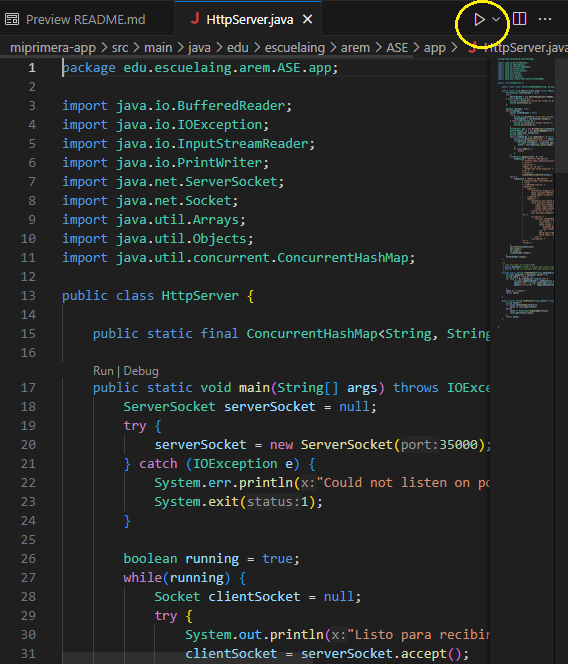
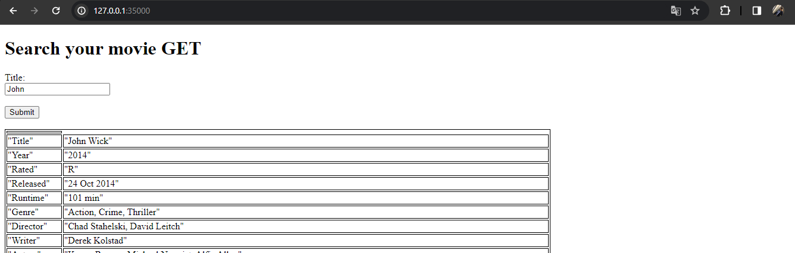

# TALLER 1: APLICACIONES DISTRIBUIDAS (HTTP, SOCKETS, HTML, JS,MAVEN, GIT)

#### Hecho por: Daniel Santiago Gómez Zabala

Se realizará un aplicación distribuidad donde se contruira con servidor HTTP que consumira una API la cual nos brindara información de peliculas. Usa unicamente GET dentro de la API para consumirla.


## GETTING STARTED

1. Debe tener instalado Maven en su computador para poder ejecutar los comandos que se le indicarán más adelante.
2. Debe contar con GITHUB para poder hacer uso del repositorio donde se alberga el laboratorio.
3. Debe tener un ambiente de java para poder visualizar y ejecutar el codigo.

## INSTALLING 

Debe clonar el respositorio para poder hacer uso de la app con el comando que se encuentra a continuación

```
git clone https://github.com/sagomezab/Taller1_AREP.git
```

Para hacer uso de la aplicación debe dirigirse a la carpeta *miprimera-app*, ingresar a source y seguir la ruta de main, allí encontrará la clase *HttpServer.java* para ejecutar la aplicación desde su editor de codigo ejecute la método main. (Como se indica en la imagén)




Después será necesario dirigirnos a nuestro navegador y colocar en el browser lo siguiente:

```
http://127.0.0.1:35000/
```
Se visualizará lo siguiente:



## Running The Tests

Para poder ejecutar las pruebas sera necesario que este dentro de la carpeta *miprimera-app* y ejecutar la siguiente linea de comando

```
mvn test
```

### Break down into the tests

Se realizaron dos pruebas principales la cuales prueban lo siguiente:

1. Cofirma que la búsqueda de las peliculas se de correctamente.
2. Lo enviado al cache se esta almacenando correctanente y a su vez su funcionamiento sea el adecuado.

## Built With

* [Maven](https://maven.apache.org/) - Administrador de dependencias

## Version

1.1

## Author

Daniel Santiago Gómez Zabala [SAGOMEZAB](https://github.com/sagomezab)

## Acknowledgments

Extensibilidad: Para cambiar la fuente de información, basta con modificar la URL. Para añadir filtros, solo es necesario agregar un formulario en el HTML, ya que la respuesta en JSON se reconoce automáticamente.

Patrones: Se implementó principalmente el patrón Fachada. El cache que se encuentra en la clase del servidor HTTP, verifica la consulta antes de ingresarla directamente en la API.

Modularidad: Cada clase contiene funciones independientes. En HttpServer, hay funciones para iniciar el servidor (método principal) y crear la tabla JSON respectiva y el Cache almacena y devuelve información si ya está en memoria, mientras que EchoClient facilita la conexión entre la página de la API y el socket creado por HttpServer.